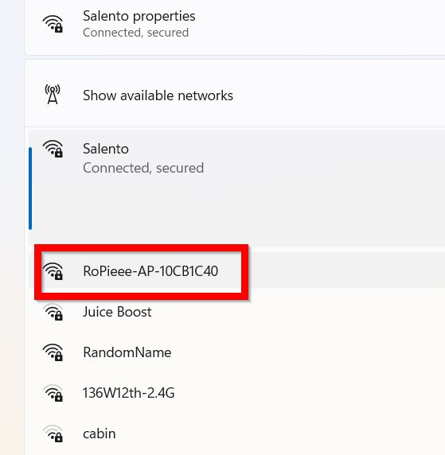

# Documentation

Over here you can find documentation about RoPieee - ranging from installation to advanced topics.

_Keep in mind that everything in this documentation is related to the latest available stable release!_

## Installation

### Hardware

To be able to install RoPieee you need an Micro SD card of at least **8 GB**. Furthermore you need hardware to run RoPieee. 
At this moment the following hardware is supported:

| Raspberry Pi Family | Model |
| ------------------- | ------------- |
| Raspberry Pi 3  | Raspberry Pi 3, Compute Module 3 and Zero W 2  |
| Raspberry Pi 4  | Raspberry Pi 4 and Compute Module 4 |
| Raspberry Pi 5  | Raspberry Pi 4 and Compute Module 5 |

Next to the Raspberry Pi, RoPieee also supports the now legacy network bridge from **Allo**, called the **Usbridge (Signature)**.

### Preparing the Micro SD card

To be able to write the RoPieee image to the Micro SD card you first need software like [Balena Etcher](https://etcher.balena.io/), and of course the latest RoPieee image that you can find [here](https://github.com/RoPieee/RoPieee/blob/main/CHANGELOG.md) 

RoPieee images are provided in a compressed (XZ) variant and an uncompressed one. The compressed variant is smaller in size, but requires decompression. Software like [Balena Etcher](https://etcher.balena.io/) is able to do that automagically for you.

> [!TIP]
> If compression sounds like 'abracadabra' to you: don't worry, just download the uncompressed variant.

> [!IMPORTANT]
> Make sure you download the correct image corresponding your hardware.

### Start the installation process

Insert the Micro SD card in the corresponding Raspberry Pi, attach an ethernet cable, and power up the unit.
RoPieee will start its installation process unattended. There is nothing for you todo, except maybe grab a cup of ☕

### Internet access during installation

RoPieee requires internet access during installation. Ideally this is done by attaching an ethernet cable. If that's not possible (for example, the **Raspberry Pi Zero 2 W** lacks a cable connection), RoPieee will setup a WiFi access point called `RoPieee-AP-[unique_id]`. 

Connect your computer to this WiFi network and use `goropieee` as password.

When connected, browse to `http://192.168.250.1` to select your wireless network and enter your password.
The unit will reboot, connect to your production wireless network, and then will continue the installation process.

### Finish the installation process

During the installation process the unit will reboot a few times. It will also show a fast blinking green LED.

After 15 minutes or so the installation process has finished. This can be seen by looking at the green LED: it should have switched from fast blinking to a steady 'heartbeat' with ½ Hz.

Furthermore you should now be able to reach RoPieee's internal webpage at http://ropieee.local

## Configuration
