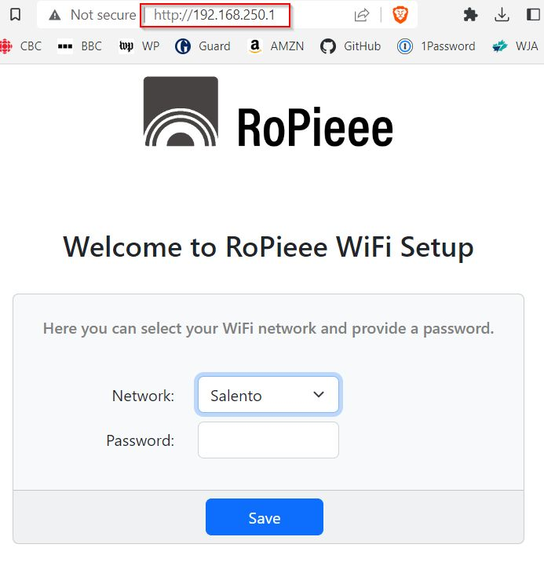
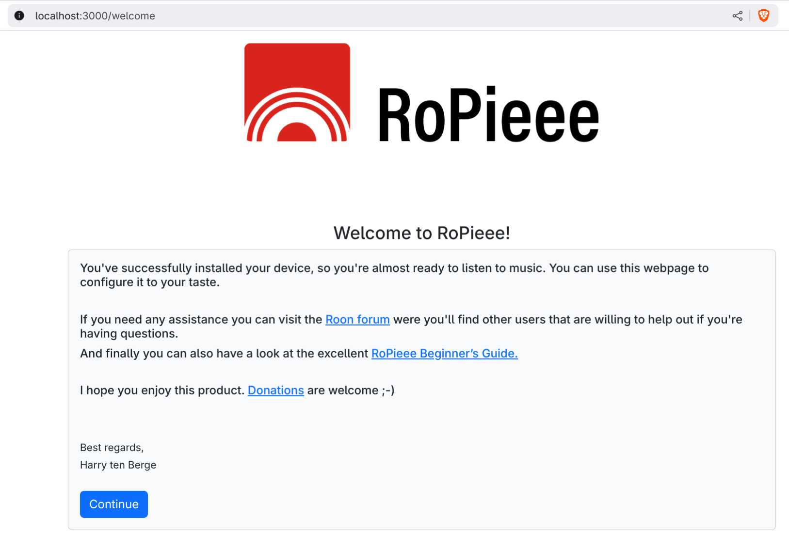
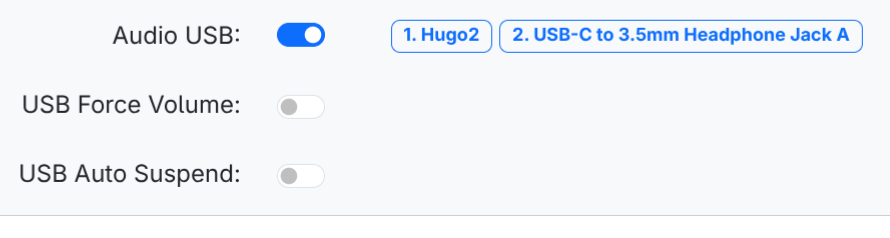
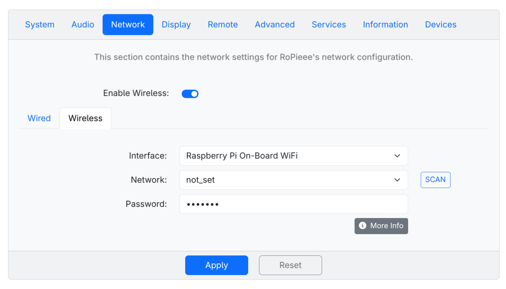

# Documentation

Over here you can find documentation about RoPieee - ranging from installation to advanced topics.

_Keep in mind that everything in this documentation is related to the latest available stable release!_

## Table of contents

- [Installation](#installation)
- [Configuration](#configuration)
  - [System](#system-settings)
  - [Audio](#audio-settings)
  - [Network](#network-settings)
- [Advanced topics](#advanced-topics)
- [Appendix A: supported HAT's](https://github.com/RoPieee/RoPieee/blob/main/APPENDIX_A.md)
- [Appendix B: USB DAC's with native DSD](https://github.com/RoPieee/RoPieee/blob/main/APPENDIX_B.md)

## Installation

### Hardware

To be able to install RoPieee you need an Micro SD card of at least **8 GB**. Furthermore you need hardware to run RoPieee. 
At this moment the following hardware is supported:

| Raspberry Pi Family | Model |
| ------------------- | ------------- |
| Raspberry Pi 3  | Raspberry Pi 3, Compute Module 3 and Zero W 2  |
| Raspberry Pi 4  | Raspberry Pi 4 and Compute Module 4 |
| Raspberry Pi 5  | Raspberry Pi 4 and Compute Module 5 |

Next to the Raspberry Pi, RoPieee also supports the now legacy network bridge from **Allo**, called the **Usbridge (Signature)**.

### Preparing the Micro SD card

To be able to write the RoPieee image to the Micro SD card you first need software like [Balena Etcher](https://etcher.balena.io/), and of course the latest RoPieee image that you can find [here](https://github.com/RoPieee/RoPieee/blob/main/CHANGELOG.md) 

RoPieee images are provided in a compressed (XZ) variant and an uncompressed one. The compressed variant is smaller in size, but requires decompression. Software such as [Balena Etcher](https://etcher.balena.io/) is able to do that automagically for you.

> [!TIP]
> If compression sounds like 'abracadabra' to you: don't worry, just download the uncompressed variant.

> [!IMPORTANT]
> Make sure you download the correct image corresponding your hardware.

### Start the installation process

Insert the Micro SD card in the corresponding Raspberry Pi, attach an ethernet cable, and power up the unit.
RoPieee will start its installation process unattended. There is nothing for you todo, except maybe grab a cup of ☕

### Internet access during installation

RoPieee requires internet access during installation. Ideally this is done by attaching an ethernet cable. If that's not possible (for example, the **Raspberry Pi Zero 2 W** lacks a cable connection), RoPieee will setup a WiFi access point called `RoPieee-AP-[unique_id]`. 

Connect your computer to this WiFi network and use `goropieee` as password.

When connected, browse to `http://192.168.250.1` to select your wireless network and enter your password.
The unit will reboot, connect to your production wireless network, and then will continue the installation process.

### Finish the installation process

During the installation process the unit will reboot a few times. It will also show a fast blinking green LED.

After 15 minutes or so the installation process has finished. This can be seen by looking at the green LED: it should have switched from fast blinking to a steady 'heartbeat' with ½ Hz.

Furthermore you should now be able to reach RoPieee's internal webpage at http://ropieee.local, and see this page:

Congratulations! :muscle: :clap: :notes:

> [!TIP]
> If you can't reach RoPieee's webpage at http://ropieee.local, try to reach the unit directly by using its IP address. You can determine the IP using a port scan application (such as [Fing](https://www.fing.io/)) as  or via your router interface, often in a
DHCP tab.

### General navigation

If you click on **`Continue`** (after you donated of course :wink:), you will see RoPieee's regular webpage. It uses several tabs to group specific settings, so let's walk them through.

## Configuration

### System settings

On the **`System`** tab you can configure the **Device Name** and **Timezone**. The device name (by default `ropieee`) is the name with which your RoPieee unit identifies on your network, and how you can reach it in a browser (via http://ropieee.local, where `ropieee` is the device name). 

If you only have one RoPieee unit in your network, then there's no real need to change its name. If you're running more than 1 unit, it is required to change its name to something unique. Don't use spaces in the device name.

The timezone is used internally by RoPieee. There's no need to change this, unless your using an additional display (TODO).

Once you **Apply** the changes, RoPieee will save the changes made and will show a popup stating that you need to run a configure step. 

> [!IMPORTANT]
> The changes made are only going to be effected after running the configure step. Depending on the changes, RoPieee can show a follow up notification stating that it requires a reboot. 

### Audio settings

On the **`Audio`** tab you can configure RoPieee's audio settings. First you can configure an audio HAT, if one attached. RoPieee supports an extensive set of HAT's, and is continously updated to support the latest models. You can find the complete HAT list over [here](https://github.com/RoPieee/RoPieee/blob/main/APPENDIX_A.md)

> [!NOTE]
> Some HAT's support automatic detection, which means that RoPieee is able to detect them during installation. They will be configured automagically.

If you have configured a HAT, you can also potentially enable **Dynamic Audio Power Management (DAPM)**: with this option it is possible to remove the audio signal completely (the HAT disables its output) - this can be handy when using a HAT with a TOSLINK output, for example.

> [!WARNING]
> Not all HAT's support DAPM!

Secondly you can configure Audio USB support. This is enabled by default. RoPieee will show the USB DAC's that are connected (make sure they are powered on!):

With the **USB Force Volume** setting you have the option to force the volume control of the USB DAC when starting up RoPieee. _This option is rarely needed._

And with **USB Auto Suspend** you can make the USB DAC shutdown after a defined timeout when being idle. This can be handy when the USB DAC is directly driving your power amplifier, in which case the output is disabled.

> [!WARNING]
> Not all USB DAC's support this! _In fact: most don't._

### Network settings

On the **`Network`** tab you can configure RoPieee's network settings. RoPieee will use a cabled connection with DHCP as its default configuration. You click on the button labelled More Info to get actual information about the current connection. You can change the connection type from DHCP to static by changing the **Configuration Method**.

> [!TIP]
> We advise to use DHCP at all times. In the rare case you require a static IP address, use your router's setting if possible.

RoPieee also supports wireless (WiFi) connections, if a wireless interface is available on your hardware. First you need to **Enable Wireless**, after which RoPieee will check if the necessary hardware is available.
If that's the case, a new tab labelled **Wireless** will show next to the **Wired** tab:

Now you can select the **Interface**: RoPieee supports not only the internal wireless interface, but also external USB WiFi dongles. The reason to use one of those is that they have a larger antenna in comparison with the onboard chip.

Next click the **SCAN** button to start scanning for wireless networks. After a few seconds the scanning will finish and you are able to select the correct wireless network. Provide a password and your wireless connection is up and running.

> [!TIP]
> Although the debate about wired vs. wireless amongst audiophiles is on-going, we advise wired as the preferred connection type. Its advantages outweigh possible disadvantages by a large margin.

## Advanced topics

### About native DSD support

RoPieee supports many USB DAC's out-of-the-box, as its interface is standardized. 
That's not necessarily the case for DSD: if your USB DAC supports DSD, it's not guaranteed to be supported on RoPieee as well. This is an ommission in the standard, with mixed results as a consequence. DoP (DSD-over-PCM) however, works almost always in these cases.

> [!IMPORTANT]
> Native DSD does not offer any advantages over DoP, except that it uses slightly less bandwith. This often results in a higher maximum sample rate with native DSD vs. DoP.

Over the years we have been able to add native DSD support for many DAC's by patching the RoPieee's underlying Operating System (which is Linux). [Here](https://github.com/RoPieee/RoPieee/blob/main/APPENDIX_B.md) are the DAC's for which RoPieee has added explicit native DSD support.
